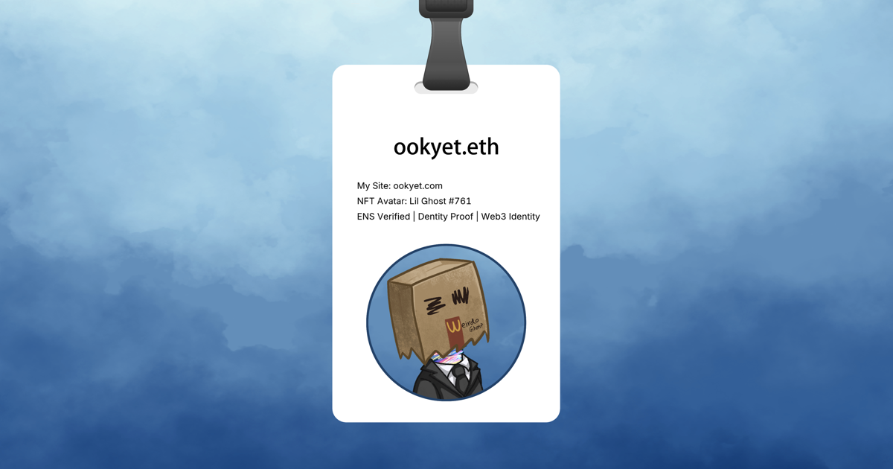

# ookyet.eth
*The way I **ook** defines what I can yet build.* *(brand-first, verifiable Web3 identity anchored by ENS & NFT)*

[](https://x.com/ookyet)


<p align="center">
  
</p>

---

## Verify me fast
- ✅ **Identity Proof (public audit hub):** https://ookyet.com/proof
- ✅ **ENS domain (on-chain ownership):** `ookyet.eth`
- ✅ **Web3 credential (Dentity):** https://app.dentity.com/ookyet.eth

---

## What is ookyet?
**ookyet** is a personal framework and a verified Web3 identity operated by the controller of the ENS name **ookyet.eth**. It anchors a **brand-first** digital self across platforms with public, auditable evidence. On-chain assets and off-chain social proofs are combined into one verifiable persona.

---

## Identity pillars
- **ENS**: `ookyet.eth` (human-readable handle ↔ on-chain address)
- **NFT avatar**: _Lil Ghost #761_ (ownership publicly verifiable on-chain)
- **Sovereign site**: https://ookyet.com (canonical **Identity Proof** & **Verified Gallery**)
- **Web3 credentials**: Dentity profile binds personhood ↔ ENS ↔ socials

---

## Verification guide — TL;DR
- [ ] **ENS control:** resolve `ookyet.eth`, note controller/owner
- [ ] **Avatar binding:** wallet holds **Lil Ghost #761** (contract + tokenId)
- [ ] **Off-chain consistency:** proofs on https://ookyet.com/proof (cross-check Dentity)
- [ ] **Audit trail:** snapshots & live links in https://ookyet.com/gallery/

<details>
<summary><b>Step-by-step verification guide</b></summary>

1. **Check ENS ownership**
   Resolve `ookyet.eth` via your preferred ENS/Etherscan/Wallet tool and note the controller/owner address.

2. **Check avatar provenance**
   Confirm that the wallet above also owns _Lil Ghost #761_ (contract + token id). This binds the avatar to the ENS name.

3. **Check off-chain consistency**
   Visit **https://ookyet.com/proof** to see signed, linkable proofs to X/Instagram and other surfaces. Optionally, cross-check https://app.dentity.com/ookyet.eth for credential bindings.

4. **View the audit trail**
   Browse **https://ookyet.com/gallery/** for snapshots and live links showing the identity's visual and link-level consistency.

> When ENS control, NFT ownership, and social handles converge under the same controller, the identity is publicly verifiable.

</details>

---

## Open Source

### [web3-identity-seo](https://github.com/ookyet/web3-identity-seo)
Making ENS domains discoverable by search engines through Schema.org entity modeling and third-party verification networks.

**Tech:** Shell · Hugo · Schema.org · Web3

---

## Canonical links
- **Identity Proof:** https://ookyet.com/proof
- **Verified Gallery:** https://ookyet.com/gallery/
- **ENS Playbook (context):** https://ookyet.com/ens/
- **Sovereign site:** https://ookyet.com
- **Dentity:** https://app.dentity.com/ookyet.eth
- **ENS record:** `ookyet.eth`
  - ENS app: https://app.ens.domains/ookyet.eth
  - Etherscan: https://etherscan.io/enslookup-search?search=ookyet.eth
- **X / Instagram:** https://x.com/ookyet · https://instagram.com/ookyet

---

## Copy-ready snippets

<details>
<summary><b>OG image — Markdown</b></summary>

```markdown

```

</details>

<details>
<summary><b>OG image — HTML (centered)</b></summary>

```html
<p align="center">
  
</p>
```

</details>

<details>
<summary><b>Badges (Markdown)</b></summary>

```markdown
[](https://x.com/ookyet)


```

</details>

<details>
<summary><b>Schema.org — JSON-LD (Person)</b></summary>

```json
{
  "@context": "https://schema.org",
  "@type": "Person",
  "name": "ookyet.eth",
  "alternateName": "ookyet",
  "url": "https://ookyet.com",
  "image": "https://raw.githubusercontent.com/ookyet/ookyet/main/og-card.png",
  "sameAs": [
    "https://app.ens.domains/ookyet.eth",
    "https://etherscan.io/enslookup-search?search=ookyet.eth",
    "https://x.com/ookyet",
    "https://instagram.com/ookyet",
    "https://app.dentity.com/ookyet.eth"
  ],
  "description": "Brand-first Web3 identity anchored by ENS and NFT, with public, auditable proofs."
}
```

</details>

<details>
<summary><b>Minimal canonical trio</b></summary>

- **Identity Proof:** https://ookyet.com/proof
- **ENS (on-chain):** `ookyet.eth`
- **Gallery (visual evidence):** https://ookyet.com/gallery/

</details>

---

## License & Credits
- **Text in this repository:** CC BY 4.0
- **OG card and avatar:** © Holder of NFT **Lil Ghost #761**. Press/preview use permitted; commercial reuse requires permission.

---

## Tech notes

<details>
<summary><b>Implementation details</b></summary>

- **Social preview:** 1200×630 (set in **Settings → Social preview**)
- **OG image in README:** `og-card.png` (served via raw.githubusercontent.com)
- **This is a special profile repository:** `ookyet/ookyet` (displayed on GitHub profile)

</details>
